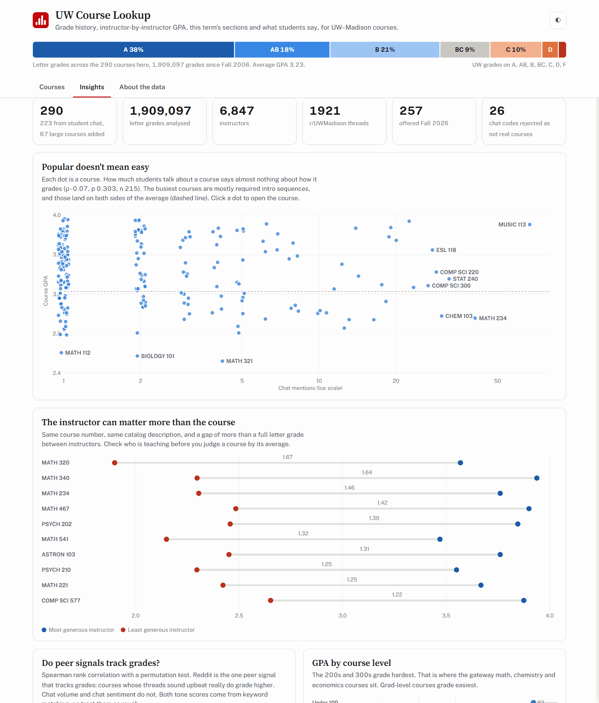

# UW Course Lookup

Grade history, instructor-by-instructor GPA, this term's sections and what students actually say, for
**290 UW–Madison courses** on one static page.

👉 **[Open the tool](https://webgrs.github.io/uw-course-lookup/)**, or open `index.html` locally (works offline).


## What you can do with it

- **Search** by code, title or instructor. Shorthand like `cs 577` or `stats 240` works, and the whole
  Fall 2026 catalog (~5,000 courses) is searchable as a fallback.
- **Filter** by subject, level, breadth, minimum GPA, or "offered this term". **Sort** by GPA, share of
  A's, grade trend, how much the instructor matters, Reddit activity or class size.
- **Open a course** to see its grade distribution against the campus baseline, GPA by term since 2006,
  every instructor's own GPA in that course (with who's teaching *this* term flagged), current sections
  and seats, and the most recent r/UWMadison threads about it.
- **Save and compare** courses side by side. Saved courses stay in your browser.
- **Share** a course with a deep link (`#/c/COMP-SCI-577`). Filters live in the URL too.

<details><summary>Course detail (dark theme)</summary>


</details>

## What the data says

The **Insights** tab and [`docs/ANALYSIS.md`](docs/ANALYSIS.md) are generated from the database. Highlights:

- **Instructor beats course.** In MATH 320, MATH 340 and MATH 234, the most and least generous instructors
  are 1.4–1.7 GPA points apart. That is more than a full letter grade on the same syllabus.
- **Popularity says nothing about difficulty.** Chat mentions vs. GPA: Spearman ρ = −0.07 (p = 0.30).
- **Reddit tone does.** Courses whose r/UWMadison threads read upbeat really do grade higher
  (ρ = +0.43, p < 0.001, n = 220).
- **Grade inflation.** Weighted GPA across tracked courses rose from 3.02 (Fall 2006) to 3.39
  (Spring 2026), and peaked in Spring 2020, the pandemic semester.



## Data sources

| Source | What it gives | How |
|---|---|---|
| [MadGrades](https://madgrades.com) | Grade counts by term, section and instructor (UW public records) | public API |
| [Course Search & Enroll](https://public.enroll.wisc.edu) | Catalog, credits, breadths, prerequisites, this term's sections | public API |
| [r/UWMadison](https://www.reddit.com/r/UWMadison/) | Threads that name each course (title + link only) | web search via Firecrawl |
| Student group chat | How often each course came up, +/− tone | anonymized aggregate counts |
| Rate My Professors | Not copied; each instructor links to an RMP search | link only |

## The database

Everything lives in one SQLite file, [`data/uwcourses.db`](data/uwcourses.db)
([schema](data/schema.sql)): 290 courses, 1.9M letter grades, 6,800+ instructors and 1,900+ Reddit threads.

```sql
-- Instructors teaching COMP SCI 577 this term, with their past GPA in it
SELECT i.name, ROUND(s.gpa, 2) AS gpa, s.graded
FROM instructor_course_stats s
JOIN instructors i ON i.id = s.instructor_id
JOIN courses c ON c.id = s.course_id
WHERE c.code = 'COMP SCI 577' AND s.teaching_now = 1;
```

The `v_courses` view has one row per course with every headline metric.

## How it's built

```
courses.json  (anonymized chat counts)          scripts/extract_courses.py
   │
   ├─ build_db.py      match every code against the real catalog: drop non-courses,
   │                   merge cross-listings (CS 240 = MATH 240), add the term's largest
   │                   courses, pull MadGrades history + current sections      ─► data/uwcourses.db
   ├─ fetch_reddit.py  r/UWMadison threads per course                          ─► data/reddit.json
   ├─ analyze.py       GPA, trend, instructor spread, shrunk GPA, correlations ─► insights.json, ANALYSIS.md
   └─ build_site.py    export compact data + render the page                   ─► assets/*.js, index.html
```

```bash
python scripts/pipeline.py              # rebuild everything (API responses are cached in data/cache/)
python scripts/pipeline.py --refresh    # also refresh this term's seats
python scripts/pipeline.py --reddit     # also re-query Reddit (needs FIRECRAWL_API_KEY)
python -m unittest discover -s tests    # parser, matcher, stats and database checks
```

Python 3 standard library only. The page is vanilla HTML/CSS/JS with hand-drawn SVG charts and no build step.
CI runs the tests on every push. A manual **Refresh data** workflow rebuilds and commits fresh data.

### A few details worth knowing

- **Catalog verification.** 26 of the 256 chat-extracted codes weren't real courses (for example,
  "comp sci 300" read as NUTR SCI 300). They are dropped and listed in
  [`data/rejected_codes.json`](data/rejected_codes.json).
- **Adjusted GPA.** "Highest GPA" ranks by an empirical-Bayes estimate that pulls small courses toward
  their subject's mean, so a 12-student seminar can't top the list on luck.
- **Trend.** Weighted least-squares slope of term GPA since Fall 2016, in GPA points per year.
- **Significance.** Correlations are Spearman ρ with a 2,000-shuffle permutation p-value.

## Privacy

The chat data never leaves the machine it was exported on. The repo holds only per-course aggregate
counts. The extractor now also enforces k-anonymity: a course mentioned by fewer than three distinct
people is dropped, so a rare course can't identify the one person taking it. The current `courses.json`
predates that filter and will pick it up the next time the extractor runs. Reddit data is limited to thread
titles and links, with no usernames or comment text. Instructor grade data is public record,
republished by MadGrades.

## License

MIT
