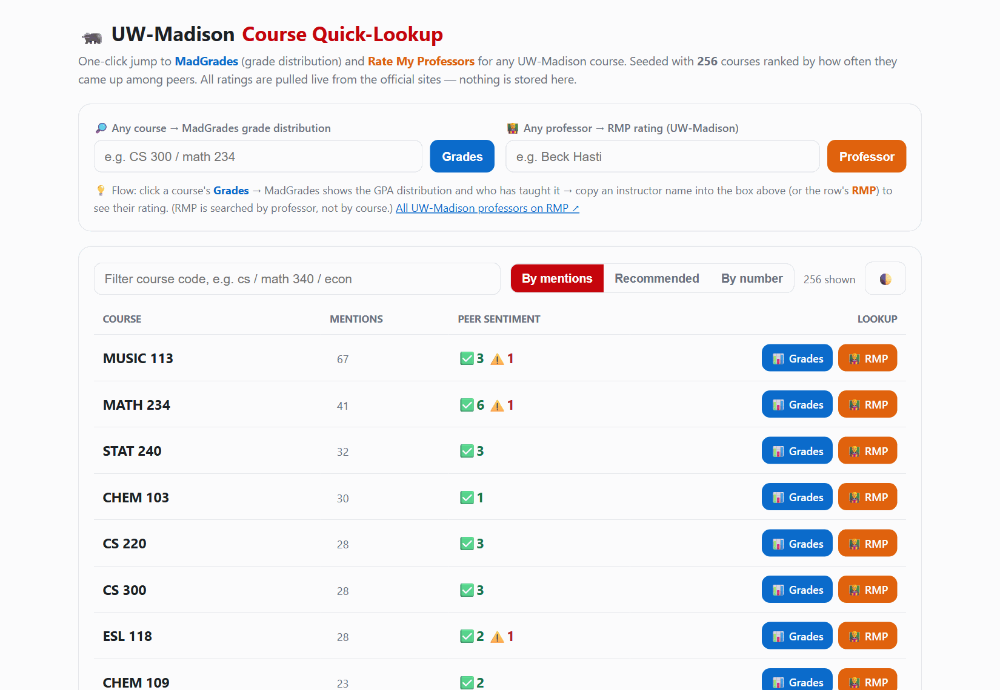
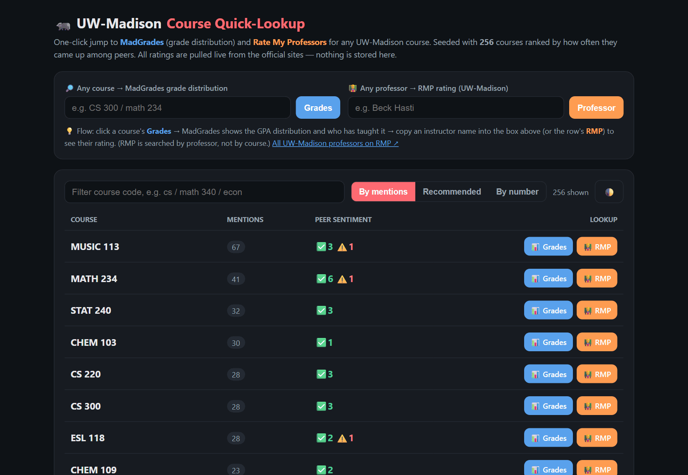

# UW-Madison Course Quick-Lookup

A tiny, dependency-free web tool that jumps from any UW–Madison course straight to its
**[MadGrades](https://madgrades.com) grade distribution** and its instructors'
**[Rate My Professors](https://www.ratemyprofessors.com/school/18418) ratings** — in one click.

It ships seeded with **256 courses** ranked by how often they came up among peers, so the
courses students actually take float to the top. All ratings are pulled **live from the
official sites**; nothing is scraped, cached, or stored here.

👉 **[Open the tool](https://webgrs.github.io/uw-course-lookup/)** (GitHub Pages) or just open `index.html` locally.



<details><summary>Dark theme</summary>



</details>

## Features
- 🔎 Universal lookup — type any course or professor, jump to MadGrades / RMP.
- 📊 Per-course **Grades** button, auto-mapped to MadGrades' full subject name (e.g. `CS` → `computer sciences`) for reliable hits.
- 👨‍🏫 Per-course **RMP** button scoped to UW–Madison (school id `18418`).
- Live filter, three sort modes (by mentions / recommended / by number), light & dark themes.
- Single static HTML file, works offline; only touches the network when you click a link.

## How the seed data was built
The course-popularity list was mined from a UW–Madison student group chat I'm part of, then
fully **anonymized** before anything was committed:

```
WeChat DB (own export)                # PyWxDump: decrypt + merge -> SQLite
  └─ scripts/extract_courses.py       # regex course codes, alias-merge, aggregate counts
       └─ courses.json                # ANONYMIZED: code + counts only
            └─ scripts/build_site.py  # inject data into index.template.html
                 └─ index.html
```

Reproduce on your own exported data:
```bash
python scripts/extract_courses.py --db merge_all.db --group "<id>@chatroom" --out courses.json
python scripts/build_site.py --data courses.json --out index.html
```

## 🔒 Privacy
This repository contains **only aggregate, non-identifying data**: a course code and how many
times it was mentioned, plus a +/- sentiment tally. It deliberately contains **no messages,
names, phone numbers, user ids, or any personal data**. The raw chat databases and exports are
never committed (see `.gitignore`), and the extraction script is written so it can only ever
emit aggregate counts. Run it against **your own** data only.

## Tech
Vanilla HTML/CSS/JS (no framework, no build step) · Python 3 (stdlib only) · protobuf
wire-format parsing for WeChat `BytesExtra` · SQLite.

## License
MIT
