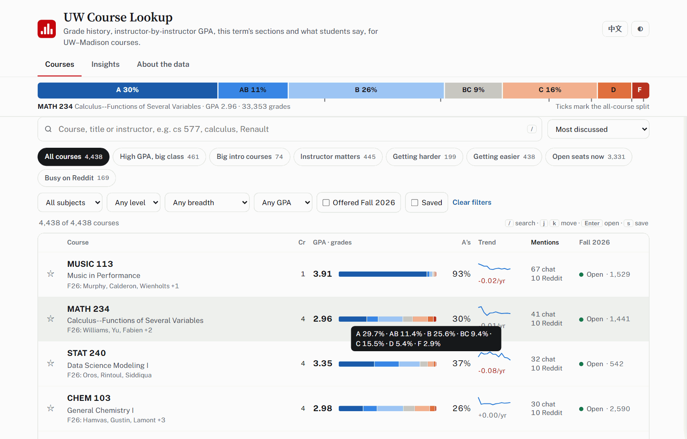
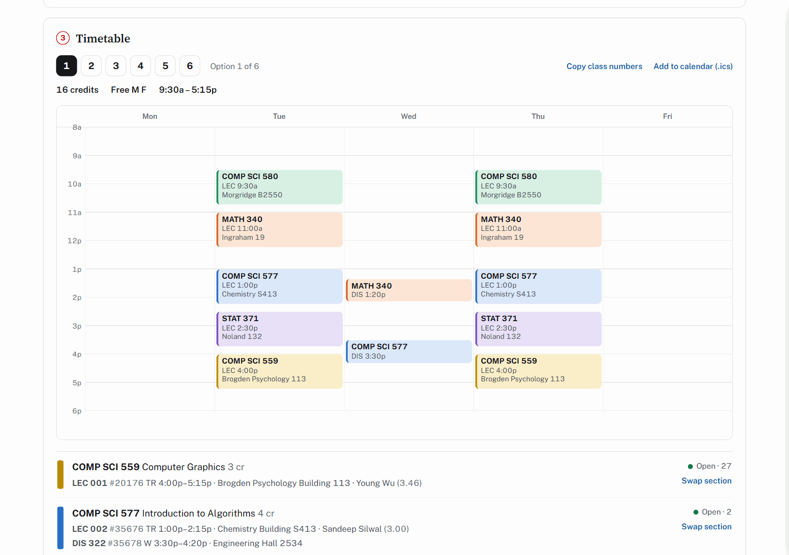
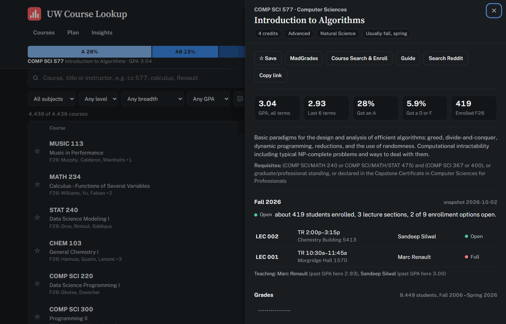
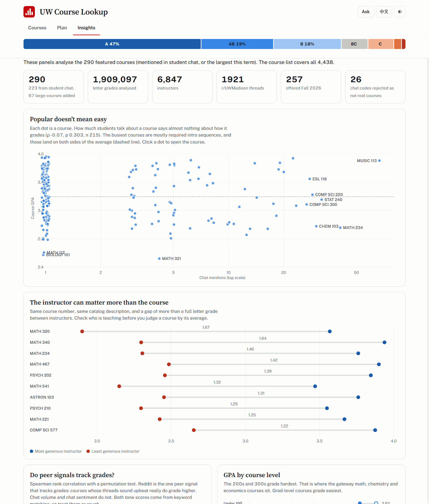

# UW Course Lookup

Grades, instructors and seats for **every course in the Fall 2026 catalog (4,400+ UW–Madison courses)**, plus a
degree-aware timetable planner and an assistant that can answer questions about all of it.

👉 **[Open the tool](https://webgrs.github.io/uw-course-lookup/)**



## What you can do with it

**Look courses up.** Search by code, title or instructor (`cs 577`, `calculus 234`, `calc feldman`). Open a course for its
grade distribution against the campus baseline, GPA by term since 2006, every instructor's GPA in that course, this
term's sections with days, times and rooms, and recent r/UWMadison threads. Filters and a handful of sort orders narrow
4,400 courses fast.

**Plan a term.** Pick your program (212 undergraduate majors, copied from the UW Guide), import your transcript or DARS,
add the courses you must take, and let the planner fill the rest from your unmet requirements.



- Reads a PDF or pasted text **in your browser**; nothing is uploaded. Courses with a grade count as taken; credits
  without a grade count as in progress.
- Requirement blocks (`all`, `choose n`, `n credits`) show what is done, in progress and left, with a button to add any
  option. Rules the Guide words in prose are shown as notes instead of being guessed.
- Builds conflict-free timetables from real meeting times: no early classes, days off, seat availability, compact days,
  easier instructors. Half-term sections only clash when their dates overlap.
- Six options, section swapping, class numbers to copy, and a `.ics` export for your calendar.
- If the request is impossible it says why ("COMP SCI 577 and MATH 340 always overlap", "every section is full").

**Ask.** The assistant panel answers in English or 中文 and can act on the page: search courses, read a course, update your
plan and build the timetable. It answers from the same data the page uses and says so when a search finds nothing.

Also: English / 中文, light and dark themes, deep links (`#/c/COMP-SCI-577`, filters in the URL).

<details><summary>Course detail (dark theme)</summary>



</details>

## What the data says

The **Insights** tab and [`docs/ANALYSIS.md`](docs/ANALYSIS.md) are generated from the database. Highlights:

- **Instructor beats course.** In MATH 320, MATH 340 and MATH 234, the most and least generous instructors are 1.4–1.7 GPA
  points apart, more than a full letter grade on the same syllabus.
- **Popularity says nothing about difficulty.** Chat mentions vs. GPA: Spearman ρ = −0.07 (p = 0.30).
- **Reddit tone does.** Courses whose r/UWMadison threads read upbeat grade higher (ρ = +0.43, p < 0.001, n = 220).
- **Grade inflation.** Weighted GPA across the 290 featured courses rose from 3.02 (Fall 2006) to 3.39 (Spring 2026).



## How it works

```
GitHub Pages  ──►  index.html + assets/ (no course data inside)
                      │  assets/programs/*.json    degree requirements (public, from the UW Guide)
                      │  fetch /api/courses  /api/course/ID  /api/plan  /api/compare  /api/insights
                      │  POST /api/chat            one assistant step; the page runs the tool loop
                      ▼
Cloudflare Worker  ──  the whole dataset lives here, built locally and deployed with `wrangler`;
                       it is not in this repository. Workers AI answers /api/chat.
```

The timetable solver (`assets/js/planner/schedule.js`) and the degree logic (`degree.js`) are plain modules with no DOM or
network access, so the page, a Web Worker and the Node tests all run the same code. The solver is a depth-first search
with forward checking over each course's enrollment packages (a lecture plus the discussion that goes with it), then a
beam over optional requirement courses to reach your credit target. It returns the best result it found, not a proof of
optimality.

| Endpoint | Returns |
|---|---|
| `GET /api/meta` | counts, subjects, breadths, lens totals, campus grade split, term dates |
| `GET /api/courses` | one page of list rows: `q`, `sort`, `subj`, `lvl`, `br`, `gpa`, `now`, `lens`, `ids`, `offset`, `limit` (≤ 60) |
| `GET /api/course/:id` | the full record behind the course drawer |
| `GET /api/compare?ids=…` | up to 8 full records |
| `GET /api/plan?ids=…` | up to 40 courses with credits, requisites, instructor GPA and every package's meeting times; cross-listed ids resolve |
| `GET /api/insights` | the aggregate panels of the Insights tab |
| `POST /api/chat` | one model step for the assistant; the Worker owns the system prompt and the tool list |

Only the page is meant to call the API: requests must come from the site's origin, each client is rate-limited per
minute, and no endpoint returns the dataset in bulk. That raises the cost of copying everything; it cannot make copying
impossible, because anything the page can show, a patient scraper can read too.

## Data sources

| Source | What it gives | How |
|---|---|---|
| [MadGrades](https://madgrades.com) | Grade counts by term, section and instructor (UW public records) | public API |
| [Course Search & Enroll](https://public.enroll.wisc.edu) | Catalog, credits, breadths, prerequisites, this term's sections with meeting times and seats | public API |
| [UW Guide](https://guide.wisc.edu) | Degree requirement tables for 212 undergraduate programs | scraped by `scripts/fetch_programs.py` |
| [r/UWMadison](https://www.reddit.com/r/UWMadison/) | Threads that name each course (title + link only) | web search via Firecrawl |
| Student group chat | How often each course came up, +/− tone | aggregate counts, never the messages |
| Rate My Professors | Not copied; each instructor links to an RMP search | link only |

## Run it yourself

```bash
python scripts/pipeline.py              # build data/uwcourses.db, analysis, worker/data.json, assets/config.js
python scripts/pipeline.py --refresh    # also refresh this term's sections and seats
python scripts/pipeline.py --programs   # also re-scrape degree requirements
python scripts/pipeline.py --term 1274  # another term, e.g. Spring 2027 once Enroll publishes it
python scripts/check_times.py           # compare meeting times with the official site (needs Playwright)
node worker/dev-server.mjs              # page + API at http://127.0.0.1:8787/ (no assistant)

python -m unittest discover -s tests    # parsers, meeting-time conversion, program scraper, database checks
cd worker && npm test                   # API, solver, degree logic and assistant proxy

cd worker && npx wrangler login         # once
cd worker && npx wrangler dev           # API with the assistant (Workers AI runs in the cloud)
python scripts/pipeline.py --deploy     # rebuild and deploy the API
```

Without a chat seed file (`courses.json`, kept private) the build still works and simply has no chat-sourced tier.
Python 3 uses the standard library plus `beautifulsoup4` and `lxml` (`pip install -r requirements.txt`) for the program scraper; the page is vanilla
HTML/CSS/JS modules with hand-drawn SVG charts. `site.config.json` holds the public API URL that `build_site.py` writes
into `assets/config.js`. CI runs the tests on every push and fails if a private data file is ever committed.

```
courses.json  (private, chat counts)            scripts/extract_courses.py
   │
   ├─ build_db.py      match every code against the real catalog: drop non-courses,
   │                   merge cross-listings (CS 240 = MATH 240), add the term's largest
   │                   courses and every other catalog course, pull MadGrades history,
   │                   current sections and meeting times (offerings.py)         ─► data/uwcourses.db
   ├─ fetch_reddit.py  r/UWMadison threads per course                          ─► data/reddit.json
   ├─ analyze.py       GPA, trend, instructor spread, shrunk GPA, correlations ─► insights.json, ANALYSIS.md
   ├─ build_site.py    export, withhold small counts                           ─► worker/data.json, assets/config.js
   └─ fetch_programs.py  degree requirement tables from guide.wisc.edu        ─► assets/programs/*.json
```

### A few details worth knowing

- **Three tiers.** `chat` (223 courses mentioned in student chat), `enrollment` (67 largest courses this term) and
  `catalog` (the other ~4,150: grades and seats, no peer signal). The first two drive the Insights tab.
- **Meeting times.** Enroll stores clock time as UTC shifted by a fixed six hours (even in September), which only the
  website can confirm: `python scripts/check_times.py` compares a sample of sections with public.enroll.wisc.edu and
  should be run for every new term. Consent-only rows (independent study) are collapsed to one marker and never scheduled.
- **Degree requirements are a guide, not an audit.** The Guide's tables are parsed into blocks; about one block in eight
  has a rule only expressed in prose and is shown as a note. DARS decides what counts.
- **Adjusted GPA.** "Highest GPA" ranks by an empirical-Bayes estimate that pulls small courses toward their subject's
  mean, and ignores courses with fewer than 50 graded students.
- **Significance.** Correlations are Spearman ρ with a 2,000-shuffle permutation p-value.

## Privacy

- Your transcript is parsed in the page. Your plan (program, courses taken, preferences) is stored in your browser's
  local storage and never sent to the course API.
- The assistant sends your messages, and what its tools return, to the Worker, which forwards them to Cloudflare Workers
  AI. If you ask about your plan, the plan summary is part of that. Nothing is stored server-side.
- The chat data never leaves the machine it was exported on. What the site publishes from it is limited to aggregates:
  a course mentioned fewer than three times shows no count and no tone, and the dataset itself is gitignored.
- Reddit data is limited to thread titles and links, with no usernames or comment text. Instructor grade data is public
  record, republished by MadGrades.

## License

MIT
